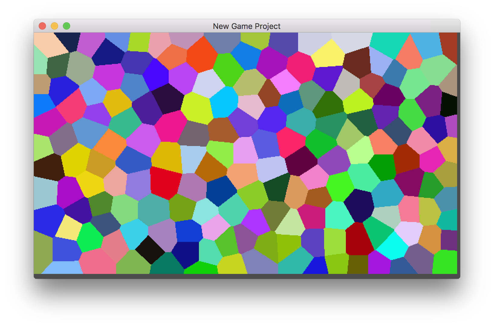

# #100DaysOfCode Log - Round 1 - andymac (pilotInPyjamas)

The log of my #100DaysOfCode challenge. Started on [July 17, Monday, 2017].

## Log

### R1D1 
Something abstract: Another chapter of "Category Theory For Programmers" and coq "Software Foundations". Looking to write verifiable code.

### R1D2
Something Concrete: Implemented a (fairly naive) algorithm for vector voronoi diagrams in Godot: this will hopefully end with procedural map generation for a simple FPS idea I have.

### R1D3
Implemented Bridson's algorithm. This algorithm generates fairly evenly spaced points, so the voronoi polygons are now far more regular than before.:

#### R1D4 

Generic vectors in C: One of C's limitations is no type safe generic functions. You either use void* or macros. Macros end up inlined everywhere and void* is a bit unsafe. I have a solution that solves both problems:

[Link](https://t.co/CNVp9e589S)
