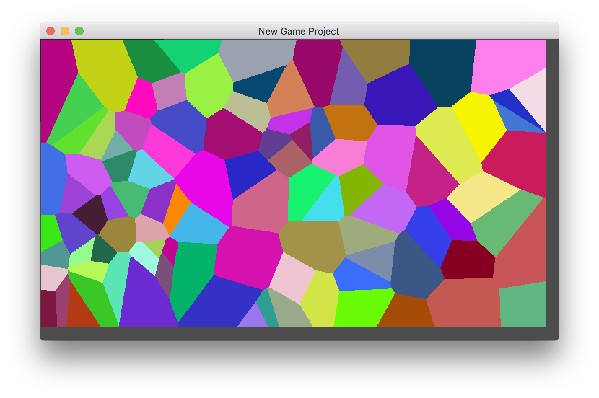

# #100DaysOfCode Log - Round 1 - andymac (pilotInPyjamas)

The log of my #100DaysOfCode challenge. Started on [July 17, Monday, 2017].

## Log

### R1D1 
Something abstract: Another chapter of "Category Theory For Programmers" and coq "Software Foundations". Looking to write verifiable code.

### R1D2
Something Concrete: Implemented a (fairly naive) algorithm for vector voronoi diagrams in Godot: this will hopefully end with procedural map generation for a simple FPS idea I have.

